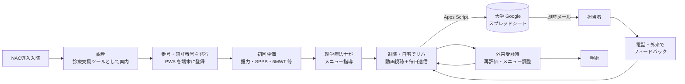
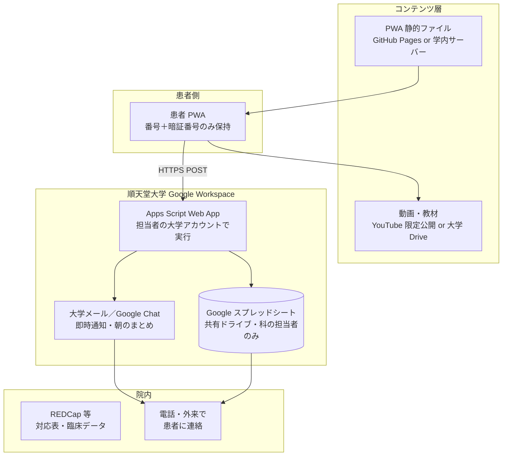

# 術前リハビリテーション支援アプリケーション 企画・要件定義・設計書

作成日: 2026-09-08
更新日: 2026-09-11
作成者: （順天堂大学 肝胆膵外科）
バージョン: 0.6（前向き単群 feasibility パイロット研究として実施する方針に変更）
関連プロジェクト: `../術前管理用アプリケーション/`（服薬・NAC・栄養を含む術前管理アプリ。匿名 ID 運用の思想を本書でも踏襲）

---

## 決定事項（v0.2）

- 対象は **膵癌に対して術前化学療法（NAC）を行う患者** に限定する
- **NAC 導入目的の入院時**に説明・ID 発行・初回評価・運動指導を行い、退院後は**自宅で動画を見ながらリハビリを継続**する
- リハビリの内容は **週 3 回・1 回 30〜50 分の structured exercise（運動セッション）＋ 毎日のウォーキング**。具体的な種目・回数はリハビリテーション科と協議して確定し、動画を作成する（現在の種目定義は仮）
- **体調確認はセッション前と運動後の 2 回のみ**。セッション前の確認で **青（症状なし・概ね元気）は通常セッション、黄（化学療法の影響などで少し体調が悪い）は 5〜10 分の軽いメニュー、赤（発熱、強い悪心・嘔吐、ふらつき、脱水、疼痛、本人ができないと判断）は中止** に分岐する
- **患者はセッションを行う曜日を事前に設定**（初期設定時に選択、既定は月・水・金、設定画面で変更可）。曜日は週の回数管理と予定日遂行率の集計に使う
- 患者は毎日「歩いたか（分）／セッションをしたか（種別・時間）／できなかった理由／運動後の体調ときつさ」を PWA から送信し、**医療者は日常診療の範囲で電話・外来により連絡・フィードバック**する。体重入力・連絡希望チェックは持たない（電話番号の表示のみ）
- **医療者への即時通知は「赤信号で中止」「運動後に症状」の 2 条件のみ**。それ以外は朝のまとめとスプレッドシートで把握する
- スプレッドシートに **全体サマリー**（症例ごとに 1 行の累積集計と現在の状況）と **患者ごとの日次シート**（1 日 1 行で経過を追う）を自動生成する
- 本アプリを用いた NAC 中の在宅リハビリを **前向き・単群の feasibility パイロット研究** として実施する（§12）。倫理審査委員会の承認と文書同意を得てから患者登録を始める。主要評価項目は実施可能性（登録率、セッション遂行率、継続率、安全性）とし、その結果をもとに grant を申請して本研究（比較試験）へ進む
- 配布形態は **PWA のまま**（App Store 配布は本研究への移行時に再検討）
- 患者記録の保存先は **順天堂大学の Google Workspace（大学アカウント）上の Google スプレッドシート（共有ドライブ）** とし、**研究 ID のみ**を扱う。送信・通知は Google Apps Script で行う（§7）
- **患者の識別情報（氏名・病院 ID 等）と臨床データ（レジメン、NAC 開始日、外来日、評価値、手術関連）は REDCap 等の院内管理システムで研究 ID に紐づけて管理し、アプリ・スプレッドシートには置かない**。アプリ側は研究 ID・患者入力・対応記録・運用情報のみ
- **学外の未承認クラウド（Supabase 等）は患者記録の保存に使用しない**
- **氏名・生年月日・病院 ID 等の直接識別情報はアプリ・スプレッドシートに一切保存しない**。研究 ID との対応は REDCap 等の院内システムで管理する
- 収集項目は**診療上必要な最小限**に絞る（EQ-5D 等の研究目的の項目は入れない）
- 診断・治療判断を行う機能は持たせない（SaMD 非該当設計）。信号判定は医療者があらかじめ定めた自己チェック項目の集計であり、赤信号時は「中止して、症状が強ければ病院へ連絡」を案内するのみ
- 着手前に **情報管理部門へ「大学 Google Workspace で研究 ID のみの患者由来データを扱う運用」の可否を確認**する（§7.9）

---

## 1. 概要

膵癌に対する NAC（GnP、mFOLFIRINOX、GS 等）は数か月に及び、その間に骨格筋量・身体機能・栄養状態が低下すると術後合併症や在院日数、化学療法の完遂率に影響する。本アプリは NAC 期間を **prehabilitation（術前リハビリテーション）の機会**と捉え、

1. 入院時に指導した **週 3 回の運動セッション（30〜50 分）を自宅でも動画を見ながら順に実施**できるようにし、毎日のウォーキングを促し
2. **セッションとウォーキングができたか、できなかった場合はその理由と体調**を患者自身が毎日送信し
3. 医療者が**当日中に把握して、必要な患者に電話や次回外来で声をかける**

ことで、在宅期間のリハビリ継続率を高め、手術に臨む身体機能を維持・向上させることを目的とする。「毎日の記録がその日のうちに医療者に届く」ことを最優先し、それ以外の機能は最小限にする。

## 2. 背景・課題

- 膵癌患者は診断時点でサルコペニア・低栄養を高頻度に合併し、NAC 中にさらに骨格筋量が減少する症例が多い。NAC 中の骨格筋量減少は術後合併症・予後不良と関連する
- NAC 中の在宅運動プログラム（home-based prehabilitation）は膵癌でも実施可能（feasible）で、身体機能・QOL の維持に寄与すると報告されている（Ngo-Huang らの MD Anderson の一連の報告、横浜市大 Nakajima らの肝胆膵手術での術前運動・栄養介入など。論文化時に文献を再確認する）
- 一方、外来で口頭・紙で指導した運動は**自宅での実施状況が把握できず**、次回外来まで数週間空くため介入のタイミングを逃す
- 高齢患者が多く、**紙の日誌は記入・回収の負担が大きい**。動画によるフォーム確認もできない
- 化学療法中は骨髄抑制・末梢神経障害・発熱などで**運動を控えるべき日**があり、その判断基準を患者に分かりやすく伝える必要がある

## 3. 対象と利用フロー

### 3.1 対象患者

- 膵癌（切除可能・切除可能境界を主とし、局所進行例も含みうる）で NAC を予定し、順天堂医院で手術を予定している患者
- 除外の目安: 自力歩行困難、運動制限を要する心肺疾患、認知機能障害で本人・家族とも入力困難、スマートフォン・タブレットを利用できない

### 3.2 利用フロー



- **入院時（Day 0）**: 説明 → 番号・暗証番号の発行（カード）→ 初回評価 → 指導。PWA のホーム画面追加・番号入力・送信テストをスタッフが一緒に行う
- **在宅期間**: 週 3 回「セッションを始める」→ 体調確認（信号）→ 青なら通常セッション、黄なら軽いメニュー、赤なら中止。毎日ウォーキングを行う。1 日 1 回「歩いた分数」「セッションをしたか・時間」「できなかった理由」「運動後の体調ときつさ」を送信（1 分で完了する設計）
- **医療者側**: 未実施・症状あり・連絡希望の送信があれば**即時にメールで通知**。毎朝、前日の一覧と未送信者一覧がメールで届く。必要な患者に電話で状況を聞き、対応記録を残す
- **外来受診時**: スプレッドシートの実施状況・体重推移を一緒に見ながら面談。再評価・メニュー変更
- **手術前**: 最終評価

## 4. 想定ユーザー

| ユーザー | 利用シーン | 端末 |
|---|---|---|
| 患者（主に 60〜80 代） | 自宅で動画視聴・毎日の送信 | スマートフォン／タブレット（PWA。Google アカウント不要） |
| 患者家族 | 代理入力 | 同上（患者と同じ端末、または同じ番号・暗証番号） |
| 理学療法士 | メニュー指導・評価登録・記録確認 | 院内 PC（大学 Google アカウントでスプレッドシート閲覧） |
| 医師（肝胆膵外科） | 通知確認、電話・外来での声かけ、運動可否の判断 | 院内 PC・大学メール |
| 看護師・管理栄養士 | 症状・体重の確認、栄養指導との連携 | 院内 PC |

高齢者が主対象のため、**大きな文字・少ないタップ数・平易な日本語・1 画面 1 タスク**を UI の最優先要件とする。

## 5. 主要機能

### 5.1 患者アプリ（PWA）

**(a) 初期設定**

- 入院時に交付するカードの **番号（4 桁）と暗証番号（4 桁）** を数字キーで入力するだけ。スタッフが患者のスマートフォンに一緒に入力する。メールアドレス・電話番号・Google アカウント・QR 読み取りは不要
- 入力時にサーバーで照合し、メニューの種類（標準／低体力／神経障害あり）を受け取る。通信できない場合はスタッフがメニューを選んで設定できる
- 続けて **セッションを行う曜日を選ぶ**（既定は月・水・金。3 日を推奨）。設定画面でいつでも変更できる
- 設定は端末内（localStorage）に保持。端末紛失時は院内で番号を無効化（スプレッドシートの患者一覧で `status` を変更）

**(b) ホーム**

- **毎日のウォーキング**（目標分数と注意）
- **運動セッション（週 3 回・30〜50 分）**: 今週の完了回数（例: 1 / 3 回、あと 2 回）、今日が予定日かどうかと次の予定曜日、ブロック構成の目安時間、「セッションを始める」ボタン（予定日は強調表示。予定外の日でも開始できる）
- 今日の記録の送信状況、緊急連絡先

**(c) セッション前の体調確認（信号判定）**

「セッションを始める」を押すと最初に体調を確認する。あてはまる項目を押すか「症状なし・概ね元気」を押して判定する。

| 信号 | 該当項目 | 対応 |
|---|---|---|
| **青** | 症状なし・概ね元気 | 通常セッション（30〜50 分） |
| **黄** | だるい、軽い吐き気・食欲がない、下痢ぎみ、手足がしびれる、点滴の当日・翌日、軽い痛み | **軽いメニュー（5〜10 分）**。本人が体調に自信があれば通常メニューに切り替え可 |
| **赤** | 38 ℃以上の熱、強い吐き気・嘔吐、ふらつき・めまい、口の渇き・尿が少ない（脱水）、強い痛み、今日は運動できないと感じる（この場合は症状を自由記載） | **中止**（他の選択肢は出さない）。記録を送ると担当者に即時通知。症状が強ければ病院へ連絡するよう案内 |

赤が 1 つでもあれば赤、黄のみなら黄、なければ青。項目の文言・分類はリハビリテーション科・腫瘍内科と協議して確定する。

**(d) セッションプレイヤー（中核機能）**

- 信号に応じて **通常メニュー**（ウォームアップ → 筋力トレーニング → 有酸素運動 → クールダウン）または **軽いメニュー**（軽く体を動かす → 軽い筋力 → 呼吸とストレッチ、5〜10 分）を、種目を 1 つずつ動画・目標回数・注意点とともに表示。「できた → 次へ」「飛ばす」で進む。経過時間を表示
- 途中で「ここで終わる」も可。終了時に所要時間と実施項目数を表示し、「運動後の体調を記録して送る」へ引き継ぐ（信号・種別・時間・実施種目が入力済みになる）
- ブロック・種目・回数はプログラム定義（`patient-pwa/src/data/program.ts`）にあり、リハビリテーション科と確定した内容に差し替える。テンプレートは 標準／低体力／神経障害あり の 3 種（各テンプレートに通常メニューと軽いメニューを持つ）

**(e) 毎日の送信（運動後の体調確認を含む）**

1 日 1 回、次の順に入力して送信する。体調に関する質問はここでの「運動後の体調」1 画面だけ。

1. **今日は歩きましたか**: 歩かなかった／10／20／30／45／60 分以上
2. **運動セッションはしましたか**: 予定日なら した／一部だけした／できなかった、予定外の日なら 今日はしていない（既定）／予定ではないがした／一部だけした。した場合は所要時間（セッション画面から来た場合は入力済み）
3. **運動後の体調**（歩行またはセッションをした日のみ）: 問題なし／少し疲れた・つらかった／症状が出た（息切れ・動悸、めまい・ふらつき、痛み、吐き気、強い疲れ、その他）＋ きつさ（修正 Borg 0〜10、顔アイコン）
4. **できなかった理由**（セッション未実施・一部、または歩かなかった場合のみ、複数選択）: だるさ、吐き気・食欲がない、熱がある、痛み、しびれ・ふらつき、下痢、点滴の日、時間がなかった、忘れていた、その他
5. **ひとこと**（任意）

赤信号で中止した場合は 1〜4 を飛ばし、ひとことだけ確認して送信する。送信後の画面には病院の電話番号を常に表示する（連絡希望のチェックは設けない）。送信後は「送信しました。担当者が確認します」と表示し、端末内の履歴にも保存する。電波がない場合は端末に保持して次回起動時に再送する。

**(f) 教育コンテンツ**

- 運動の意義、NAC 中の注意点、たんぱく質摂取、呼吸訓練の意味、手術までの流れ（動画・図解）

**(g) リマインド**

- 端末のアラーム機能で代用（サーバーからのプッシュ通知は持たない）。設定画面に運動時間を登録する案内を置く

**(h) これまでの記録**

- 端末内の履歴から直近 4 週間をカレンダー表示（セッションをした日・歩いた日・運動なし・休む日）、今週のセッション回数、4 週間の歩行日数・合計分数

### 5.2 医療者側（Google スプレッドシート ＋ Apps Script）

専用ダッシュボードは作らず、**大学 Google アカウントでアクセスするスプレッドシート**を医療者側の画面とする。

**(a) 即時通知メール**

送信内容が次の **2 条件のいずれか** に該当した場合だけ、担当者（複数可）の大学メールに即時送信する。件名・本文は番号と内容のみ。

- セッション前の確認が**赤信号**（中止）
- **運動後に症状**が出た

セッション未実施・歩かなかった・ひとことは即時通知せず、朝のまとめと患者ごとの日次シートで把握する。

**(b) 朝のまとめメール（毎日 8:00）**

- 前日の全患者の送信一覧（番号、信号、歩行、セッション種別・時間・予定日か、理由、運動後の体調、Borg、ひとこと）
- 予定日にセッション未実施だった患者
- 2 日以上送信のない患者一覧
- 今週のセッション回数（予定日の経過数つき）と直近 7 日の歩行日数
- 要連絡の患者と理由

**(c) スプレッドシートのタブ**

| タブ | 内容 | 更新者 |
|---|---|---|
| 患者一覧 | 番号、暗証番号ハッシュ、メニューテンプレート、担当者、状態 | 医療者 |
| 日次記録 | 患者からの送信（追記のみ。手動編集しない） | Apps Script |
| 対応記録 | 電話・外来で伝えた内容、次回対応 | 医療者 |
| 全体サマリー | **症例ごとに 1 行**で、その患者の全期間の累積を並べる: 記録期間、送信日数、予定日数・予定日に実施した回数・遂行率・未実施回数、セッション総回数（した／一部、予定外、通常／軽い）、平均所要時間、信号の判定回数と青・黄・赤の回数・割合、赤・黄の項目内訳、運動後の記録回数と問題なし・つらい・症状の回数・症状割合・症状内訳、平均 Borg、歩いた日数・割合・平均分数・合計分数、できなかった理由の内訳。最終行に全体の合計行 | 自動 |
| 進捗_番号（患者ごとに 1 タブ） | **1 日 1 行で、セッションができたかどうかを日ごとに追う**。上部に番号・状態・担当・設定曜日・今週のセッション回数・最終送信・要連絡を表示し、その下に日付（最新が上）、曜日、予定日、送信の有無、信号と項目、本人の記載、セッション（した／一部／できなかった／予定なし）、メニュー、所要時間、実施種目数、歩行と分数、できなかった理由、運動後の体調・症状・Borg、ひとこと。行の色で 赤信号／運動後症状／黄信号／セッション実施／予定日未実施／未送信 を区別 | 自動 |
| 通知ログ | いつ誰に何を通知したか | Apps Script |

**(d) 患者への連絡**

- **電話または次回外来**で行う（日常診療の範囲）。アプリ内メッセージ機能は初期スコープ外
- 電話の内容は対応記録タブに残す（日時、研究 ID、担当、手段、内容、次回対応）
- 対応の目安: 赤信号・運動後の症状は当日中（即時通知）、予定日が過ぎても今週セッション 0 回・運動なし 3 日連続・2 日以上未送信は朝のまとめを見て翌診療日に電話で確認（運用ルールは §14）

**(e) 集計**

- 全体サマリーと患者ごとの日次シートをもとに、Google スプレッドシートのグラフで推移を表示できる
- 必要に応じて Looker Studio（大学アカウント内）で科内共有用の集計画面を作る

## 6. リハビリテーションプログラム（構成案）

**週 3 回・1 回 30〜50 分の structured exercise（運動セッション）＋ 毎日のウォーキング**を基本構成とする。種目・回数・強度は**リハビリテーション科の医師・理学療法士と協議して確定**し、その内容で動画を作成する。アプリは「確定したプログラムの表示・進行・記録」を行う。

### 6.1 運動セッション（週 3 回、30〜50 分）

| ブロック | 目安 | 内容（仮） |
|---|---|---|
| ウォームアップ | 5 分 | 座って足踏み、ストレッチ |
| 筋力トレーニング | 15〜25 分 | スクワット、椅子立ち上がり、かかと上げ、壁腕立て、ゴムバンド、バランス。10 回 × 2〜3 セット |
| 有酸素運動 | 5〜10 分 | 足踏み・踏み台昇降・その場歩き。Borg 3〜4 |
| クールダウン | 5 分 | 深呼吸、ストレッチ |

- 曜日は固定せず、**週の回数（3 回）で管理**する。おすすめ曜日（月・水・金）は表示のみ
- テンプレート: 標準（40〜50 分）／低体力（30 分）／神経障害あり（30〜40 分、片脚立ちを除きつかまり動作中心）
- **軽いメニュー（黄信号用、5〜10 分）**: 座って足踏み 2 分・ストレッチ → 椅子立ち上がり 5 回・かかと上げ 10 回 → 深呼吸・ストレッチ。点滴当日・翌日など体調が万全でない日はこちらを行い、通常セッションは別の日に振り替える

### 6.2 毎日のウォーキング

- 目標: 標準 30 分／低体力 15 分／神経障害あり 20 分（屋内・手すりのそば）。分けて歩いてもよい
- 「ややきつい」と感じる速さ。買い物などの歩行も含めてよい

### 6.3 呼吸訓練・栄養

- 深呼吸・呼吸訓練器はクールダウンに含めるほか、毎日行うよう教育コンテンツで案内
- たんぱく質摂取の目安、ONS の摂取確認は栄養部と連携

**信号判定の基準（案・要協議）**: 赤＝38 ℃以上の発熱、強い悪心・嘔吐、ふらつき・めまい、脱水、強い疼痛、本人ができないと判断。黄＝だるさ、軽い悪心・食欲低下、下痢、しびれ、点滴当日・翌日、軽い痛み。青＝症状なし・概ね元気。採血結果に基づく休止（血小板 5 万/µL 未満、Hb 8 g/dL 未満など）はアプリでは判定せず、医療者が電話で指示する。

## 7. データ管理・セキュリティ（順天堂大学 Google Workspace 構成）

### 7.1 取り扱うデータの分類

| 区分 | 具体例 | 保存場所 |
|---|---|---|
| 直接識別情報 | 氏名、生年月日、病院 ID、住所、電話番号 | **アプリ・スプレッドシートに保存しない**。研究 ID との対応表は **REDCap 等の院内管理システム**で管理 |
| 臨床データ | レジメン、NAC 開始日、外来日、握力・SPPB・6MWD・体組成等の評価値、手術・術後情報 | **REDCap 等の院内管理システム**（研究 ID で紐づけ）。アプリ・スプレッドシートには置かない |
| 研究 ID（番号） | 4 桁の番号（1001〜） | スプレッドシート・患者端末 |
| 患者送信データ | 歩行、運動前の信号と項目、セッション（予定日か・種別・時間）、理由、運動後の体調と Borg、自由記載 | スプレッドシート（大学 Google Workspace・共有ドライブ） |
| 対応記録 | 電話で伝えた内容、次回対応 | スプレッドシート |
| 運用情報 | メニューテンプレート、担当者メール、状態 | スプレッドシート |
| コンテンツ | 運動動画、教材、PWA 本体 | 識別情報を含まないため配置自由（動画は YouTube 限定公開または大学 Google Drive、PWA は GitHub Pages または学内 Web サーバー） |
| 自由記載 | 患者のひとこと | 個人名等が書かれうるため、患者向け画面に「名前や住所は書かないでください」と表示 |

### 7.2 全体構成



- 患者端末とスプレッドシートの間には **Apps Script（大学アカウントで実行）** だけが存在し、スプレッドシート自体は患者に公開しない
- 医療者は大学 Google アカウント（2 段階認証必須）でスプレッドシートを閲覧する
- 対応表と臨床データは Google 上に置かず、REDCap 等の院内システムで管理する。研究 ID が両者を結ぶ唯一のキー

### 7.3 患者 → スプレッドシートの送信経路

**案 A（推奨）: Apps Script Web App**

- Apps Script を「実行ユーザー: 担当者の大学アカウント、アクセス: 全員（匿名を含む）」で Web アプリとして公開し、PWA から JSON を POST する
- Apps Script 側で番号と暗証番号（SHA-256 ハッシュ）を患者一覧タブと照合し、不一致・無効化済みは破棄する。連続失敗でロック
- 利点: 入力検証、重複送信の排除（同日 2 回目は上書き扱い）、即時通知を同じスクリプトで処理できる、PWA の画面を自由に設計できる
- 注意: 大学の Workspace 管理設定で「全員アクセス」の Web アプリ公開が制限されている場合がある（§7.9 で確認）
- 実装上の注意: PWA からは `Content-Type: text/plain` で送信し CORS preflight を回避する。Apps Script の URL は公開情報になるため、暗証番号照合・連続失敗ロック（10 回で 6 時間）・レート制限（番号ごとに 1 分 10 回まで）を実装する

**案 B（フォールバック）: Google フォーム**

- Google フォーム（ログイン不要、メール収集なし）に研究 ID をプリフィルした URL を PWA から開く。回答はスプレッドシートに自動連携し、フォーム送信トリガーで通知する
- 利点: コードがほぼ不要で確実に動く
- 欠点: 暗証番号の検証ができない（番号を書き換えれば他人として送信できる）、画面デザインが固定、送信後の完了表示が PWA 側で分からない
- 案 A が管理設定で使えない場合のみ採用する

### 7.4 Google Workspace 内でのセキュリティ設定

| 項目 | 設定 |
|---|---|
| 保存場所 | **共有ドライブ**（個人の My Drive には置かない。担当者の異動・退職でデータが消えるのを防ぐ） |
| 共有範囲 | 共有ドライブのメンバーを科の担当者に限定。リンク共有は無効。外部共有は無効 |
| 役割 | 管理者（責任医師・1〜2 名）、編集者（担当医・理学療法士）、閲覧者（看護師・栄養士）。患者一覧タブのトークン列はシート保護で管理者のみ編集可 |
| 認証 | 大学アカウント＋ 2 段階認証。私物端末での閲覧は科のルールに従う（原則院内 PC） |
| 日次記録タブ | 追記のみ。手動編集はシート保護で禁止。Apps Script の実行アカウントのみ書き込む |
| 監査 | Google Drive の変更履歴・アクティビティと Apps Script の実行ログを監査記録とみなす。通知ログタブに通知履歴を残す |
| Apps Script | 暗証番号は `SHA-256(番号:暗証番号)` で患者一覧に保存し、平文はカードにのみ印字する。スクリプトの編集権限は管理者のみ |
| 通知メール | 本文は研究 ID と入力内容のみ。宛先は大学メールに限定。個人のスマートフォンへの転送は科のルールに従う |
| バックアップ | Google Drive の版履歴に加え、月 1 回 CSV を院内 PC にエクスポートして保管 |
| 保存期間・削除 | 研究計画書の定め（研究終了後 5 年）に従い保管し、その後は対応表を削除して匿名化する。同意撤回時は当該番号の行を解析から除外（希望があれば削除） |
| 端末 | 患者端末に保存するのは番号・暗証番号・端末内履歴のみ。アプリを削除すればすべて消える旨を説明 |
| リポジトリ | PWA のコードは GitHub プライベート。Apps Script の URL・共有ドライブ ID は環境変数で管理し、コードにトークン等は含めない |

### 7.5 番号（研究 ID）と暗証番号の運用

- 番号: 4 桁（1001 から連番。9001〜9999 はテスト用）。患者向けには「番号」、文書上は研究 ID と呼ぶ
- 暗証番号: 4 桁。院内 PC の発行ツールが推測されにくい値を自動生成する（同一数字・連番・1234 等を除外）。患者の希望で手入力も可
- 対応表（番号 ⇔ 病院 ID・氏名・電話番号）と臨床データは **REDCap 等の院内管理システムで管理**し、管理責任者を定める。電話連絡の際はこの対応表で患者を特定する。REDCap を診療支援用途で使えない場合は院内 PC の暗号化 Excel で代替する
- 暗証番号の平文は患者に渡すカードにのみ印字し、REDCap にもスプレッドシートにも保存しない。忘れた場合は新しい暗証番号を再発行し、患者一覧の `pin_hash` を更新する
- 端末紛失・利用終了時は `status` を `inactive` にして送信を拒否する
- 4 桁暗証番号は総当たりに弱いため、番号ごとの連続失敗ロック（10 回で 6 時間）とレート制限で補う。守る対象が匿名化された運動記録であることを踏まえた設計。強度を上げたい場合は 6 桁に変更できる

### 7.6 通知の設計

| 通知 | トリガー | 宛先 | 内容 |
|---|---|---|---|
| 即時 | 赤信号で中止、または運動後に症状 | 担当者（患者一覧の担当列＋共通宛先） | 番号、信号と該当項目、本人の記載、歩行、セッション、運動後の体調、Borg、ひとこと |
| 朝のまとめ | 毎日 8:00 の時間主導トリガー | 科の担当者全員 | 前日一覧、予定日に未実施、未送信者、今週のセッション回数、要連絡者 |
| 週次 | 月曜 8:15 | 責任医師 | 患者ごとの先週の送信日数・セッション回数（予定日数）・歩行日数・分数・赤信号回数 |

- Google Chat（大学 Workspace 内のスペース）への投稿も可能。メールとの併用は運用開始後に決める
- 通知が届かない障害に備え、朝のまとめが届かなかった日はスプレッドシートを直接確認する運用ルールを置く

### 7.7 法規・ガイドライン・倫理

- **個人情報保護法**・**順天堂大学の個人情報保護規程／情報セキュリティポリシー／学外クラウド利用規程**。大学の Google Workspace は大学契約のサービスだが、**患者由来データ（研究 ID のみ）を置く運用の可否**は情報管理部門に確認する。Google のデータ保存先が国外となりうる点も含めて確認する
- **医療情報システムの安全管理に関するガイドライン（厚生労働省、第 6.0 版）**: 本アプリは診療録ではない補助資料と位置づけ、重要な所見（赤信号での中止、運動後の症状、体重減少、電話での指示内容）は**電子カルテにも記載**する
- **人を対象とする生命科学・医学系研究に関する倫理指針**: 前向き単群 feasibility 研究として研究計画書・同意説明文書を作成し、倫理審査委員会の承認後に登録を開始する。運動介入を伴うため介入研究として扱われる可能性があり、その場合は jRCT/UMIN に事前登録する
- **プログラム医療機器（SaMD）該当性**: 診断・治療方針の決定を行わず、指導内容の表示・記録・リマインドに限定。信号判定は医療者があらかじめ定めた自己チェック項目を集計して「通常／軽め／中止」の運動メニューを提示するもので、疾患の診断や治療方針の決定は行わない
- 動画・教材の**著作権・肖像権**: 学内で撮影し、出演者の同意を得る

### 7.8 不採用・保留とした構成

| 案 | 判断 | 理由 |
|---|---|---|
| Supabase 等の学外クラウド | 不採用 | 大学との契約がなく、監査・ガイドライン準拠・責任分界を担保できない。姉妹プロジェクトでは採用したが本プロジェクトでは使わない |
| REDCap（対応表・臨床データ） | 採用 | 研究 ID と患者の対応表、レジメン・評価値・手術情報などの臨床データの置き場。アプリ側の記録とは研究 ID でのみ結ぶ。診療支援用途での利用可否は臨床研究センターに確認 |
| REDCap ＋ MyCap（患者入力まで） | 本研究で検討 | 比較試験に進む時点で、患者入力も REDCap に寄せる案。本構成の項目をそのまま Data Dictionary に写す |
| 学内 VM に自前サーバー | 保留 | 申請・保守の負荷が大きい。Google Workspace 構成が情報管理部門・倫理委員会で認められない場合の代替 |
| 完全サーバーレス（端末内保存＋外来で QR 読み取り） | 保留 | 最も手続きが軽いがリアルタイム性がない。Google Workspace 構成も自前サーバーも認められない場合の最終代替 |

### 7.9 大学・病院側に確認する事項（着手前チェックリスト）

- [ ] 情報管理部門: 大学 Google Workspace の共有ドライブに**研究 ID のみの患者由来データ**を保存する運用の可否。申請の要否
- [ ] Google Workspace 管理者: Apps Script Web アプリを「全員（匿名を含む）」に公開できるか。不可なら Google フォームの「組織外からの回答」が許可されているか
- [ ] 倫理委員会事務局: 本研究が観察研究か介入研究か（介入研究なら jRCT/UMIN 登録）。アプリの軽微な修正の扱い
- [ ] 診療科: 研究責任者、分担者、運用手順書
- [ ] 動画の配置先（YouTube 限定公開／大学 Drive）の可否
- [ ] 臨床研究センター: REDCap を「研究 ID 対応表・臨床データの管理」に使えるか（診療支援用途の可否）。不可なら院内 PC の暗号化 Excel
- [ ] 研究 ID 対応表・臨床データの管理責任者
- [ ] 同意説明文書（研究の目的、アプリの仕組み、データの保存先と扱い、番号のみを扱うこと、アプリを削除すれば端末内のデータは消えること、名前等を書かないこと、同意撤回）
- [ ] 電子カルテへの記載ルール（何を、誰が、いつ転記するか）

## 8. データ定義

### 8.1 スプレッドシートの列定義

**患者一覧**（医療者が入力。臨床情報は持たない）

| 列 | 型 | 説明 |
|---|---|---|
| study_id | text | 4 桁の番号（文字列書式） |
| token_hash | text | トークンの SHA-256（管理者のみ編集可） |
| menu_template | int | 1=標準 2=低体力 3=神経障害あり |
| assignee_pt | text | 担当理学療法士（大学メール） |
| assignee_dr | text | 担当医（大学メール） |
| status | text | active / inactive / operated / withdrawn |
| note | text | 運用メモ（識別情報・臨床情報を書かない） |

**日次記録**（Apps Script が追記。同一 study_id・log_date の再送信は上書き）

| 列 | 型 | 説明 |
|---|---|---|
| received_at | datetime | 受信日時 |
| log_date | date | 記録日（患者端末の日付） |
| study_id | text | |
| walk_status | text | done / none / rest |
| walk_min | int | 歩いた分数（0 / 10 / 20 / 30 / 45 / 60） |
| pre_check | text | セッション前の体調確認: green / yellow / red（セッション画面を開かなかった日は空） |
| pre_symptoms | text | 該当した項目（fever, vomiting, dizziness, dehydration, severe_pain, cannot / fatigue, mild_nausea, diarrhea, numbness, chemo_day, mild_pain） |
| pre_symptom_text | text | 「今日は運動できないと感じる」を選んだときの症状の自由記載（300 字まで） |
| session_planned | bool | 患者が設定した曜日に該当する日か |
| session_days | text | 患者が設定した曜日（0=日…6=土、カンマ区切り）。集計用 |
| session_status | text | done / partial / none / not_planned |
| session_type | text | normal / mild（黄信号の軽いメニュー） |
| session_min | int | セッション所要時間（分）。プレイヤー使用時は自動 |
| session_items_done | text | プレイヤーで「できた」を押した種目コード（カンマ区切り） |
| reasons | text | 複数選択をカンマ区切り（fatigue, nausea, fever, pain, numbness, diarrhea, chemo_day, no_time, forgot, other）。赤信号で中止した場合は空 |
| reason_other | text | その他の自由記載 |
| post_borg | int | 運動後のきつさ 0〜10 |
| post_condition | text | 運動後の体調: fine / tired / symptom |
| post_symptoms | text | 運動後の症状（dyspnea, dizziness, pain, nausea, exhausted, other） |
| free_text | text | ひとこと |
| app_version | text | |
| notified | bool | 即時通知を送ったか |

**対応記録**（医療者が入力）

| 列 | 型 | 説明 |
|---|---|---|
| ts | datetime | 対応日時 |
| study_id | text | |
| staff | text | 対応者 |
| channel | text | phone / outpatient / none |
| trigger | text | 通知内容の要約 |
| content | text | 伝えた内容 |
| next_action | text | 次回対応 |
| chart_noted | bool | 電子カルテに記載済み |

**臨床データ・評価値**: スプレッドシートには置かない。REDCap 等の院内管理システムに研究 ID をキーとして登録する（例: 患者基本、NAC 経過、身体機能評価 baseline/interim/preop、手術・術後）。解析時にスプレッドシートの日次記録と番号で結合する。

**全体サマリー**（Apps Script が毎時＋受信時に再計算）: 症例ごとに 1 行の累積集計（§5.2(c) 参照）に加え、現在の状況（未送信日数、設定曜日、今週のセッション回数と経過した予定日数、運動なしの連続日数、要連絡フラグと理由）。要連絡の条件は 未送信 ≥2 日／予定日が経過して今週セッション 0 回／運動なし 3 日連続／赤信号で中止／運動後に症状。条件付き書式で要連絡行を強調。最終行は全体合計。

**進捗_番号**（同時に再計算、患者ごとに 1 タブ）: 最初の送信日から今日までを 1 日 1 行で並べる。未送信の日も行を作る。

### 8.2 PWA → Apps Script の送信データ（JSON）

```json
{
  "study_id": "1001",
  "pin": "4739",
  "log_date": "2026-09-14",
  "walk_status": "done",
  "walk_min": 30,
  "pre_check": "yellow",
  "pre_symptoms": ["fatigue", "chemo_day"],
  "pre_symptom_text": "",
  "session_planned": true,
  "session_days": [1, 3, 5],
  "session_status": "done",
  "session_type": "mild",
  "session_min": 8,
  "session_items_done": ["seated_march", "stretch", "chair_stand", "heel_raise", "breathing"],
  "reasons": [],
  "reason_other": "",
  "post_borg": 3,
  "post_condition": "fine",
  "post_symptoms": [],
  "free_text": "",
  "app_version": "0.1.0"
}
```

応答は `{"ok": true}` または `{"ok": false, "error": "invalid_token"}`（他に `locked`、`inactive`、`rate_limited`）。初期設定時は `{"action": "verify", "study_id": "1001", "pin": "4739"}` を送り、`{"ok": true, "menu_template": 1}` を受け取る。

### 8.3 PWA 端末内データ（localStorage）

```json
{
  "study_id": "1001",
  "pin": "4739",
  "menu_template": 1,
  "session_days": [1, 3, 5],
  "reminder_time": "19:00",
  "font_scale": 1.2,
  "logs": [
    { "log_date": "2026-09-14", "walk_status": "done", "walk_min": 30, "session_status": "done", "session_type": "mild", "session_min": 8, "pre_check": "yellow", "sent": true },
    { "log_date": "2026-09-13", "walk_status": "done", "walk_min": 20, "session_status": "not_planned", "session_type": null, "session_min": null, "pre_check": null, "sent": true }
  ],
  "pending": []
}
```

`pending` は未送信の記録。起動時と送信ボタン押下時に再送を試みる。

### 8.4 Apps Script の処理

- `doPost(e)`: JSON をパース → 番号と暗証番号（ハッシュ）を患者一覧と照合（失敗回数を記録、ロック判定）→ status が active か確認 → `action=verify` ならメニュー種別を返して終了 → レート制限 → 日次記録に追記（同日既存行は上書き）→ §5.2(a) の条件判定 → 該当なら `MailApp.sendEmail` で担当者へ即時通知 → 通知ログに記録 → `{"ok": true}` を返す
- `dailySummary()`: 時間主導トリガー（毎日 8:00）。前日一覧・予定日未実施・未送信者・要連絡者を集計してメール
- `weeklySummary()`: 月曜 8:15。先週のセッション回数・歩行日数・分数を集計してメール
- 設定値（担当者メール、閾値）は「設定」タブに置き、コードに埋め込まない
- テストはダミー番号（9001〜）で行い、実患者のデータをテストに使わない

## 9. 画面設計（概要）

### 9.1 患者アプリ

1. **初期設定**: 番号・暗証番号を入力 → サーバーで照合 → 送信テスト
2. **ホーム**: 日付、ウォーキング目標、セッションカード（今週 n/3、おすすめ曜日、ブロック構成、「セッションを始める」）、「今日の記録を送る」、緊急連絡先
3. **セッション**: 体調確認（あてはまる項目を押す）→ 信号表示（青: 通常の流れを表示してスタート／黄: 軽いメニューを表示してスタート、通常への切り替え可／赤: 中止して記録を送る）→ 種目ごとの画面（ブロック名、進捗、経過時間、動画、目標、やり方、「できた→次へ」「飛ばす」「ここで終わる」）→ 終了画面（所要時間・実施項目数、「運動後の体調を記録して送る」へ）
4. **今日の記録を送る**: 歩いた分数 → セッション（予定日か否かで選択肢が変わる、時間）→ 運動後の体調（問題なし／少しつらかった／症状が出た＋Borg。運動した日のみ）→ 理由（該当時のみ）→ ひとこと → 送信。赤信号で中止した場合はひとことのみ。送信後は病院の電話番号を表示
5. **これまでの記録**: 直近 4 週間のカレンダー（セッション日に S 表示）、今週のセッション回数、歩行日数・分数
6. **学ぶ**: 教育コンテンツ一覧
7. **設定**: セッションの曜日、文字サイズ、運動時間（アラーム登録の案内）、設定のやり直し

### 9.2 医療者側

スプレッドシートの各タブ（§5.2(c)）と通知メールのみ。専用画面は作らない。

## 10. 技術構成

| 層 | 採用 | 備考 |
|---|---|---|
| 患者アプリ | **PWA（Vite ＋ React、TypeScript）** | 静的ファイルのみ。ホーム画面追加で全画面表示・ローカル通知。患者データは端末内と Apps Script への送信のみ |
| PWA の配置 | GitHub Pages（プライベートリポジトリからの公開）または学内 Web サーバー | 患者データを含まないため学外配置可。Apps Script の URL を含むがトークン照合があるため問題ない |
| 送信先 | **Google Apps Script Web App**（大学アカウント） | §7.3 案 A。案 B は Google フォーム |
| 記録 | **Google スプレッドシート**（大学の共有ドライブ） | §7.4 |
| 通知 | Apps Script の `MailApp`（大学メール）。Google Chat webhook は任意 | Workspace アカウントの送信上限（1 日 1,500 通）で十分 |
| 動画 | YouTube 限定公開の埋め込み、または大学 Google Drive の動画をリンク | 患者データを含まない |
| 集計 | スプレッドシートの数式・グラフ。Looker Studio は任意 | |
| 番号発行 | 院内 PC で動くローカル HTML ツール（番号・暗証番号の生成、ハッシュ計算、カード印刷、患者一覧へ貼り付ける行の出力） | 対応表・臨床データは REDCap 等で院内管理 |
| リポジトリ | GitHub プライベート | PWA、Apps Script、発行ツールを同一リポジトリで管理 |

**有料 API・SaaS は使用しない。AI／LLM 機能は持たない。** 自前サーバー・DB は持たない。

## 11. 動画コンテンツ制作方針

- 理学療法士が監修し、学内で撮影（出演者の同意書を取得）
- 1 本 1〜3 分、種目ごとに「正しいフォーム」「よくある間違い」「回数の数え方」を含める
- 縦画面スマートフォンでの視聴を前提（9:16 または 1:1）
- 字幕・テロップで音声なしでも理解できるようにする
- 高齢者向けに動作はゆっくり、カメラは固定、背景はシンプル
- 初期は 10〜12 本程度（ウォーキングの注意点、スクワット、かかと上げ、椅子立ち上がり、壁腕立て、ゴムバンド 2 種、深呼吸、インセンティブスパイロメトリー、ハフィング、ストレッチ、バランス）

## 12. 研究としての位置づけ

**前向き・単施設・単群の feasibility パイロット研究**として実施する。研究計画書の骨子は `docs/研究/研究計画書骨子.md`。

| 項目 | 内容 |
|---|---|
| デザイン | 前向き単群パイロット（feasibility study） |
| 対象 | 膵癌に対して NAC を予定し、順天堂医院で手術を予定する患者。スマートフォンを利用でき、自力歩行が可能な者 |
| 介入 | アプリで案内する週 3 回の運動セッション（30〜50 分、体調により軽いメニュー／中止）＋毎日のウォーキング。NAC 導入入院時に指導を開始し、手術まで継続 |
| 主要評価項目 | 実施可能性: 登録率（適格者のうち同意した割合）、**予定日のセッション遂行率**、送信継続率、脱落率、安全性（赤信号の頻度、運動後の症状、有害事象） |
| 副次評価項目 | 握力・SPPB・6MWD・5 回立ち上がりの変化、CT L3 骨格筋指数の変化率、体重変化率、NAC 完遂率・相対用量強度、術後合併症（Clavien-Dindo、POPF）、在院日数、アプリの使いやすさ（簡易質問） |
| 症例数 | 20〜30 例（feasibility の推定に必要な規模。遂行率の 95 %信頼区間幅を根拠に設定） |
| 期間 | 登録 12 か月、各症例は手術（または NAC 中止）まで |
| データ | アプリ入力（Google Workspace）と臨床データ（REDCap 等）を番号で連結。§7 参照 |

**倫理・登録上の注意**

- 運動介入を研究として行うため、生命科学・医学系指針上は**介入研究**に該当しうる。倫理委員会事務局に事前相談し、介入研究として扱う場合は jRCT または UMIN への事前登録を行う（特定臨床研究には該当しない）
- **文書同意**を得てから番号を発行する。同意説明文書にアプリの仕組み、データの保存先（大学 Google Workspace、REDCap 等）、番号のみを扱うこと、同意撤回時の扱いを明記する
- 研究計画書の「データ管理」に Google Workspace（共有ドライブ、Apps Script）を記載し、情報管理部門の確認結果を添付する
- アプリは診断・治療判断を行わない旨、信号判定は自己チェック項目の集計である旨を計画書に記載する

**本研究への展開**

feasibility の結果（遂行率、継続率、安全性）と副次評価項目の変化量をもとに、科研費・grant を申請し、比較試験（歴史対照または無作為化）へ進む。その時点で REDCap＋MyCap への患者入力の統合、App Store 配布、リマインド通知の追加を検討する。

## 13. 開発ロードマップ

| フェーズ | 内容 | 目安 |
|---|---|---|
| 1 | 情報管理部門・Workspace 管理者・臨床研究センターへの確認（§7.9）、リハビリテーション科・腫瘍内科との種目・信号判定基準の協議 | 〜1 か月 |
| 2 | Google Workspace の構築（スプレッドシート・Apps Script）、GitHub Pages 公開、自分の iPhone とテスト番号で通しテスト | 並行 |
| 3 | 研究計画書・同意説明文書の作成、倫理審査申請、（介入研究なら）jRCT/UMIN 登録 | 1〜2 か月 |
| 4 | 動画撮影・編集、`program.ts` と動画 URL の確定、患者向け説明文の確定 | 並行 |
| 5 | 承認後に登録開始。20〜30 例。運用しながら文言・通知頻度を調整（アプリの軽微な修正は倫理委員会への報告要否を事前に確認） | 12 か月 |
| 6 | 解析・論文化、grant 申請、本研究の計画 | 以降 |

## 14. Open Questions

1. 情報管理部門の判断: 大学 Google Workspace に研究 ID のみの患者由来データを置く運用が認められるか。認められない場合は学内 VM 案かサーバーレス案に切り替える
2. Apps Script Web アプリの「全員」公開が大学の管理設定で許可されているか（不可なら Google フォーム案）
3. 電話対応の運用ルール: 誰が、どの通知に、何日以内に電話するか。夜間・休日の即時通知（赤信号・運動後症状）は翌診療日対応でよいか
4. 通知の宛先を担当者個人にするか、科の共有アドレス（Google グループ）にするか
5. 患者がスマートフォンを持たない場合の対応（家族の端末、紙日誌との併用）
6. 信号判定項目の最終文言と、採血結果に基づく休止指示を誰がいつ電話するか
7. 対応表・臨床データの管理責任者。REDCap を診療支援用途で使えない場合の代替（院内 PC の暗号化 Excel）
8. 術前管理アプリ（服薬・栄養・NAC 管理）との統合時期。当面は別運用とする

---

## 付録: ディレクトリ構成（予定）

```
術前リハアプリケーション/
├── README.md              ← 本ドキュメント
├── .github/workflows/     ← GitHub Pages への自動デプロイ
├── docs/
│   ├── セットアップガイド.md ← 公開までの手順
│   ├── パイロット手順.md    ← テスト患者・自分の iPhone で試す手順（まずこれを読む）
│   ├── 運用/              ← 患者向け説明文（案）。運用手順書・電話対応ルールは今後追加
│   ├── 申請/              ← 情報管理部門への確認資料
│   ├── 研究/              ← 研究計画書骨子（前向き単群 feasibility）。同意説明文書は後日
│   └── 動画/              ← 撮影台本・チェックリスト（後日）
├── patient-pwa/           ← 患者向け PWA（Vite + React + TypeScript）。README に公開手順。src/data/program.ts がプログラム定義
├── apps-script/           ← Code.gs（doPost・即時通知・朝のまとめ・全体サマリー・患者ごとの日次シート）と配置手順
├── sheets/                ← スプレッドシートのタブ・列定義の説明
└── tools/
    ├── id-generator/      ← 院内 PC で動く番号・暗証番号の発行ツール（静的 HTML、通信なし）
    └── mock-server/       ← Apps Script の代わりに手元で受信・通知・一覧表示する開発用サーバー
```
